# 🚀 Project Submission: DevSnippets AI

DevSnippets AI is an offline-first, local-first code snippet manager built using React Native, Expo, SQLite, and custom AI completion engines. It gives developers a safe, fully operational local workbench to write, store, analyze, and manage code snippets and files without requiring an active internet connection.

---

## 📸 Application Screenshots

*Replace these placeholders with your actual screenshot images before submitting!*

| Home Dashboard | Snippet Details | AI Code Insights |
| :---: | :---: | :---: |
| `<!-- Add Home Screen Screenshot Here -->` <br> ) (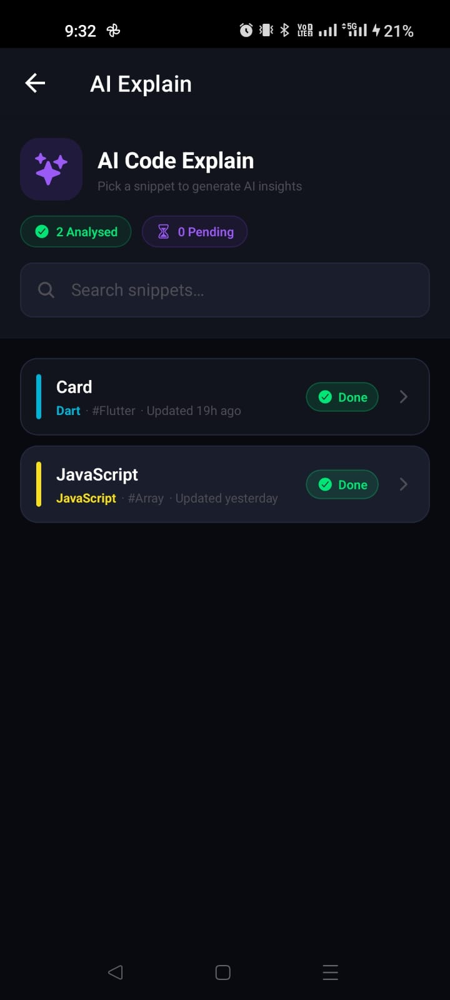) | `<!-- Add Snippet Screen Screenshot Here -->` <br> ) (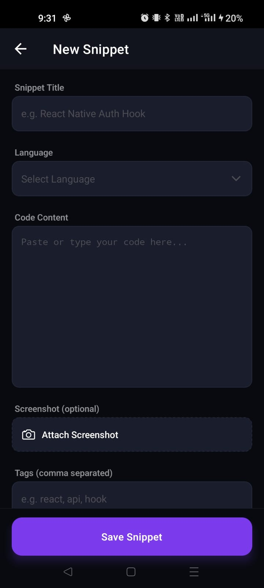) (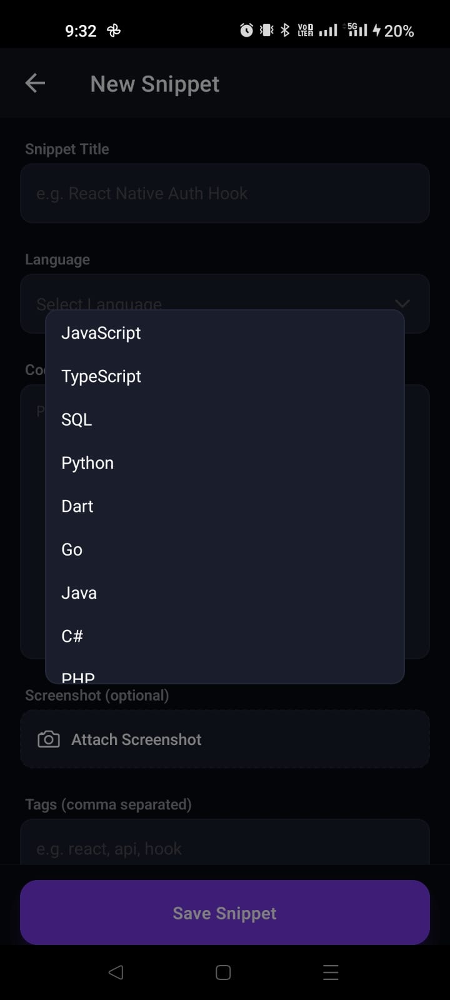) (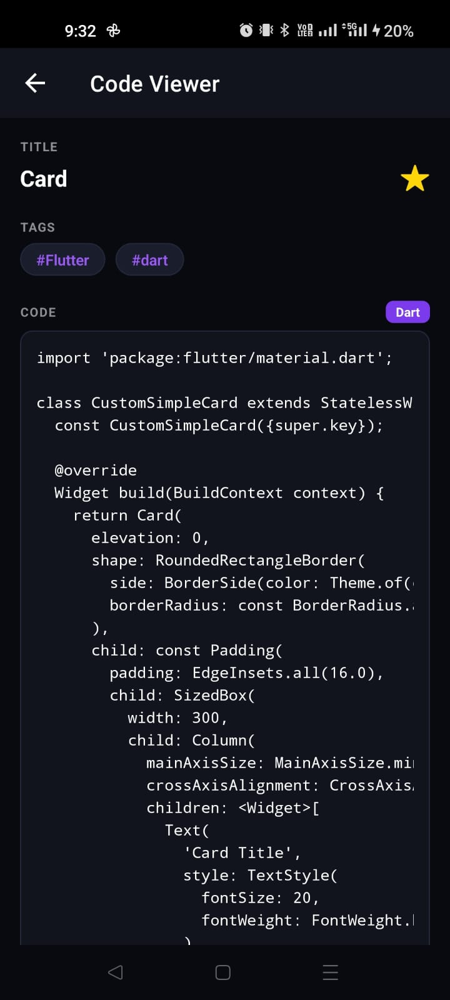) (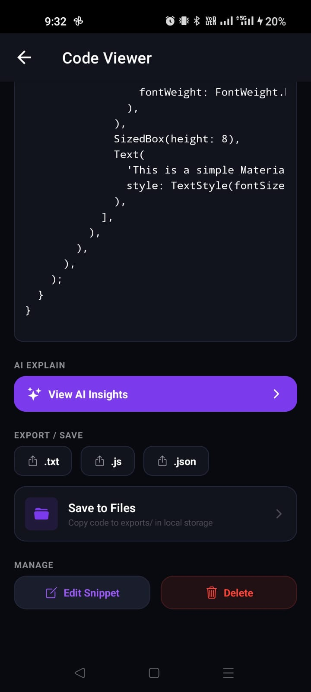) (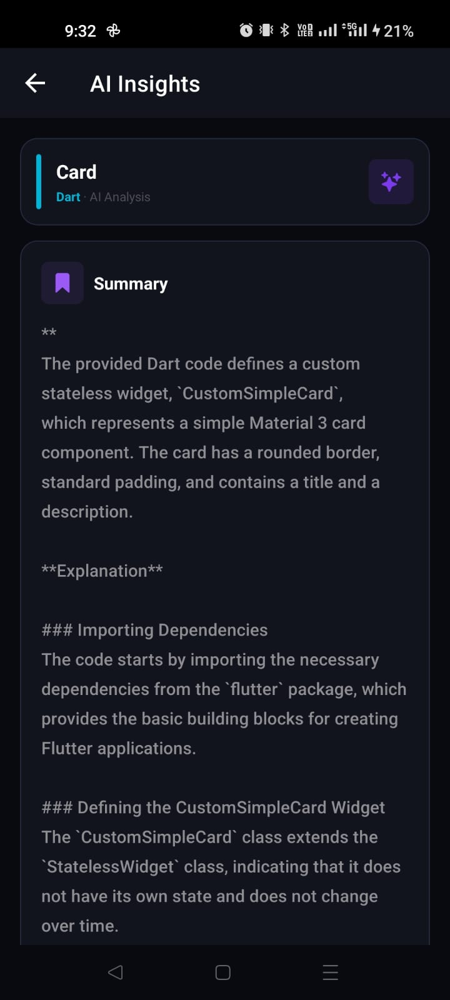) (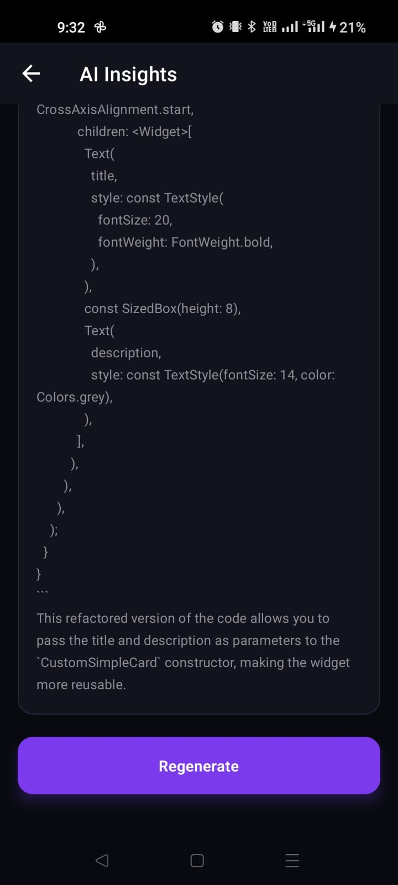) ()| `<!-- Add AI Screen Screenshot Here -->` <br> ) (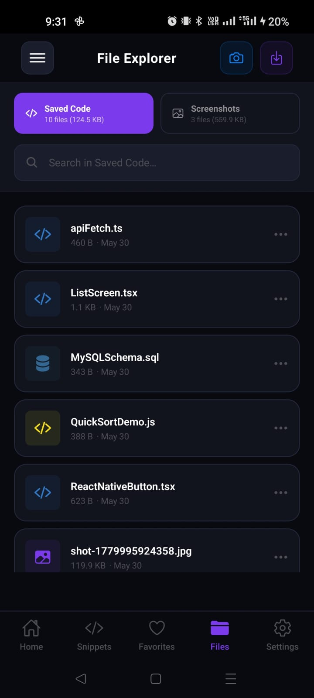) (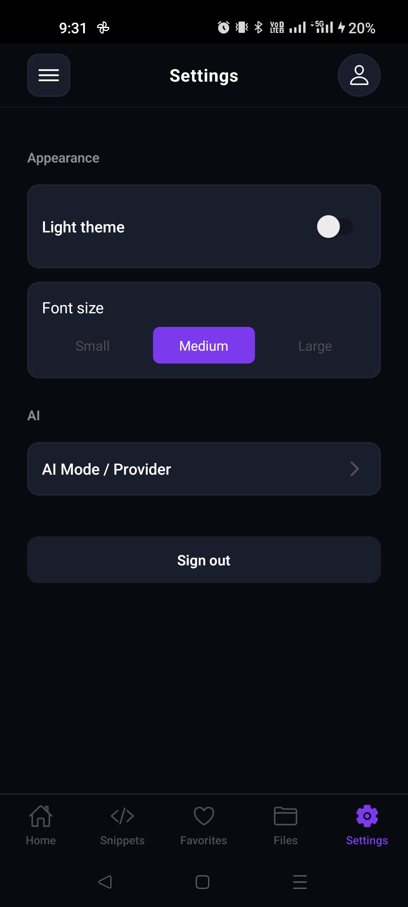) () (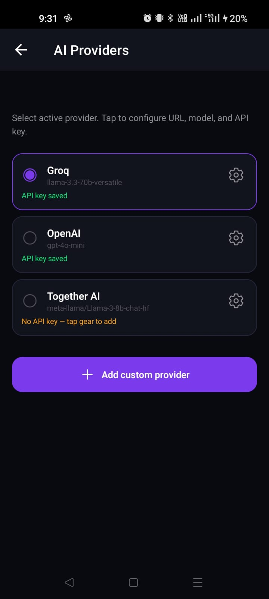) (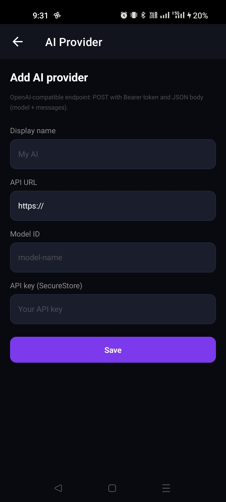) (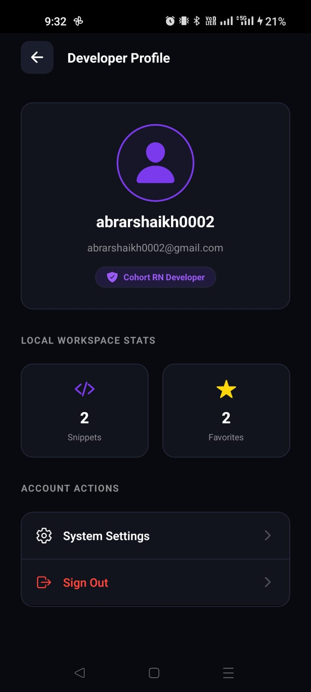) (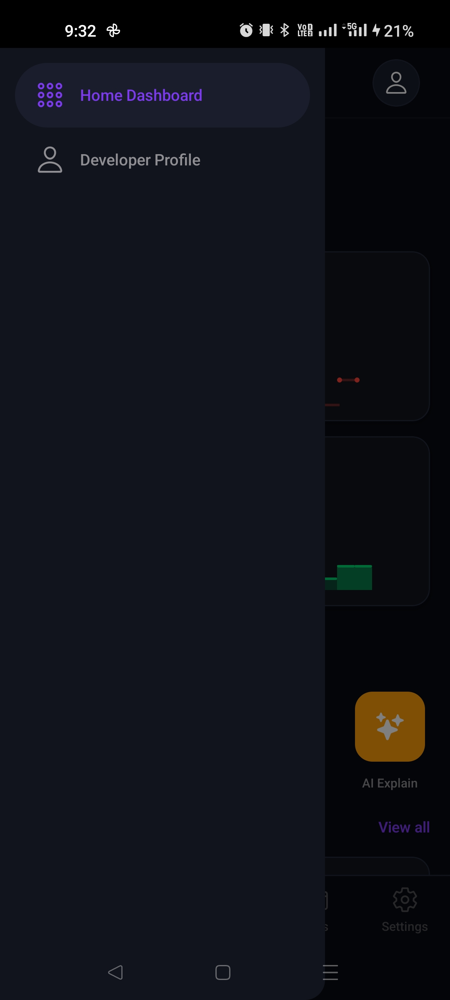) |


---

## 📁 Project Structure

Here is the exact file map of our codebase showing a highly modular and structured architecture:

```text
devsnippets-ai/
├── src/
│   ├── app/                      # Expo Router File-Based Routing
│   │   ├── (drawer)/             # Drawer Navigation Container
│   │   │   ├── (tabs)/           # Tab Navigation (Home, Snippets, Favorites, Files, Settings)
│   │   │   └── profile.tsx       # Developer Profile view
│   │   ├── settings/             # AI Provider configuration screens
│   │   ├── snippet/              # Snippet view, create, and AI insights routes
│   │   ├── auth_screen.tsx       # Login & Security passcode screen
│   │   └── onboarding.tsx        # Welcome & onboarding screens
│   ├── components/               # Highly reusable structural UI components
│   │   ├── app_bar.tsx           # Standardised header with safe area backing
│   │   ├── snippet_card.tsx      # Multi-language visual snippet card
│   │   └── stats_card.tsx        # Sparkline stats dashboard grid item
│   ├── database/                 # SQLite configuration and operations repositories
│   │   ├── db.ts                 # Database bootstrap and schema definitions
│   │   └── snippet_repo.ts       # Database CRUD and favorite transactions
│   ├── models/                   # TypeScript interfaces and type definitions
│   ├── security/                 # Sensitive keychain credential wrappers
│   ├── services/                 # Business logic services (AI, File system, Settings)
│   │   ├── ai.ts                 # AI Completion client & local code analyzer
│   │   ├── files.ts              # Local Document Sandbox operations
│   │   └── storage.ts            # AsyncStorage user session storage
│   ├── themes/                   # Theme context, HSL palettes, and sizing tokens
│   ├── ui/screens/               # Screen UI controller view layouts
│   │   ├── add_or_edit_snippet.tsx # Create & Update snippet form
│   │   ├── ai_insight_screen.tsx  # Dynamic AI summary cards view
│   │   ├── file_manager_screen.tsx# Recreated blank/clean Files Explorer
│   │   └── snippets_screen.tsx    # Scrollable snippet catalog
│   ├── widgets/                  # Auxiliary modular UI blocks & dialogues
│   └── utils/                    # Language extensions & utility helpers
```

---

## 🗄️ Database Structure (SQLite)

We use a local SQLite database (`devsnippets.db`) powered by the high-level `expo-sqlite` API. All CRUD actions are instant and zero-latency since they query our local tables before making any network requests.

### Table Schema: `snippets`
```sql
CREATE TABLE IF NOT EXISTS snippets (
  id             INTEGER PRIMARY KEY AUTOINCREMENT,
  title          TEXT NOT NULL,
  code_content   TEXT NOT NULL DEFAULT '',
  language       TEXT NOT NULL,
  ai_explanation TEXT,
  is_favorite    INTEGER NOT NULL DEFAULT 0,
  created_at     TEXT NOT NULL,
  tags           TEXT NOT NULL DEFAULT '[]',
  image_uri      TEXT
);
```

* **Storage types mapping**:
  * **Tags** are serialized and stored as JSON text arrays (e.g. `["react", "hook"]`).
  * **Favorites** are simulated using SQLite integers (`1` for true, `0` for false).
  * **Attached Screenshots** are linked using their local sandboxed filesystem file paths (`image_uri`).

---

## 💾 Offline Storage Approach

To support fully offline operations, our app leverages three storage layers for their ideal security and performance profiles:

1. **SQLite Database (`expo-sqlite`)**: Holds the primary code snippet catalog. Operates completely locally, making CRUD operations resilient to cellular dead-zones.
2. **AsyncStorage (`@react-native-async-storage/async-storage`)**: Saves theme choices (Light vs. Dark Mode) and font-size preferences.
3. **SecureStore (`expo-secure-store`)**: Stores critical information like personal API keys or OpenAI compatible endpoint credentials safely in the device’s system-level keychain.

---

## 📂 File Management Implementation

Our file management is built on top of the robust legacy `expo-file-system` API which isolates two secure sandboxes under the application directory:
* **Exports Sandbox**: `.../documentDirectory/DevSnippets/exports/`
* **Screenshots Sandbox**: `.../documentDirectory/DevSnippets/screenshots/`

### Features:
* **Attach Screenshots**: Uses `expo-image-picker` with SDK 54 compatibility (`['images']`). It copies the picture directly into our secure screenshots folder, updates SQLite, and displays it.
* **Code Exporter**: Generates custom `.txt`, `.js`, or `.json` files inside the app's `exports/` folder using `writeAsStringAsync`.
* **Explorer CRUD**: Uses `readDirectoryAsync` to scan folders, `deleteAsync` to erase files, and `moveAsync` / `copyAsync` to organize code assets.

---

## 🤖 AI Code Explanation Workflow

Our AI integration features a smart dual-pathway system ensuring code insights are generated even when totally offline.

```text
               [User Requests AI Code Insights]
                             │
                             ▼
                {Check Connection & API Keys}
               /                             \
        (Online & Key Saved)          (Offline or No Keys)
             /                                 \
            ▼                                   ▼
 [Request Remote AI Model]         [Run Fallback Local Analyzer]
  Connects to custom/OpenAI         Analyzes code syntax locally,
  endpoint over secure HTTPS.       inspects variables, loops, React
            │                       hooks & counts, then builds
            │                       functional metrics dynamically.
            \                                   /
             \                                 /
              ▼                               ▼
       [Save to SQLite database and backup export folder]
                             │
                             ▼
     [Render cards on screen with clean hierarchy & bullet-points]
```

* **Online completion**: Uses the secure API key stored in `SecureStore` to retrieve code summaries, clear operational structures, and code improvement suggestions.
* **Offline Local Fallback**: Performs complex parsing of variables, loops, async threads, error blocks, React hooks, and SQL statements. It constructs a dynamic plain-English workflow explanation and generates appropriate numbered suggestions (e.g. wrapper boundaries, memoizations, indices).

---

## 🎁 Implemented Bonus Features

* **Tactile File Sharing**: Integrates `expo-sharing` so users can instantly share code exports directly to Slack, email, or system clipboards.
* **Custom Rename Modal**: Built a custom modal text input inside the explorer to let developers rename saved exports or attachments instantly without complex native file-browsers.
* **Premium Coding Templates Library**: A dedicated templates sheet housing pre-made hooks, SQL structures, and handlers with a fast "Save All" button.
* **Vibrant HSL Theme Engines**: Features clean light & dark modes using harmonious colors and elegant rounded styles.
